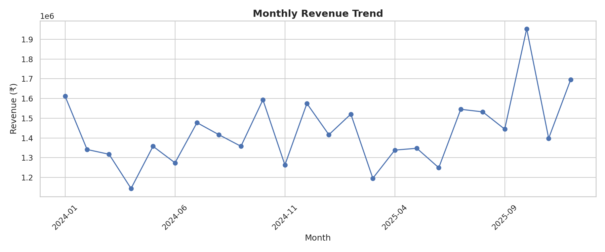
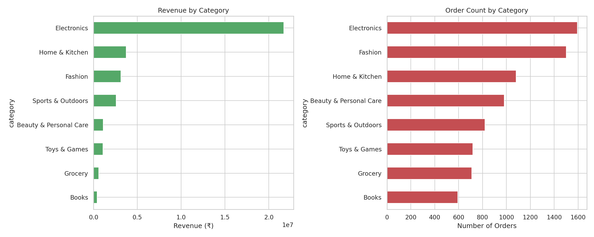
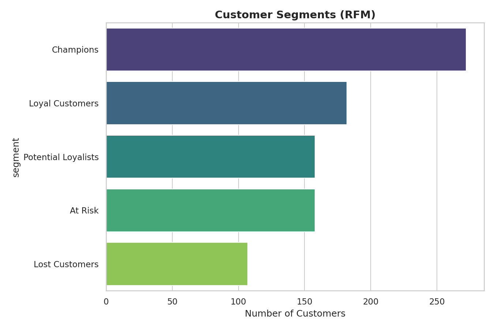
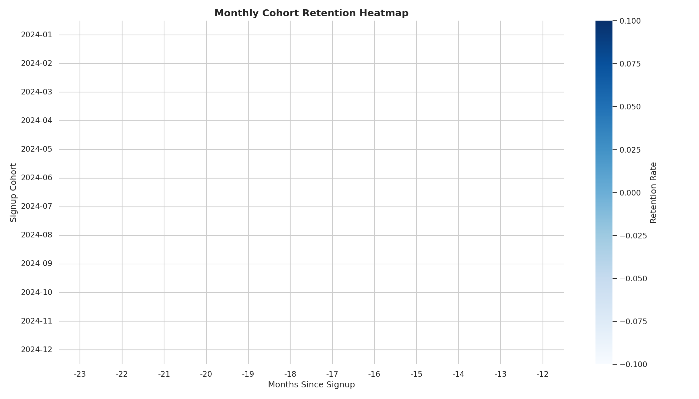

#intern id:CITS3632
<<<<<<< HEAD
# 🛒 E-Commerce Customer Behaviour Analysis


An end-to-end data analytics project exploring customer purchasing behaviour on an e-commerce platform — built as part of a **Data Analytics Internship**. The project covers data cleaning, exploratory data analysis, RFM customer segmentation, K-Means clustering, and cohort retention analysis.

---

## 📌 Project Overview

Understanding *why*, *when*, and *how* customers shop is critical for any e-commerce business. This project analyzes ~8,000 transactions from 1,000 customers to answer questions like:

- Which customer segments drive the most revenue?
- What products/categories perform best?
- How do payment method and device choice vary across customers?
- How well does the platform retain customers over time?
- What is driving product returns?

---

## 🗂️ Repository Structure

```
ecommerce-customer-behavior-analysis/
│
├── data/
│   ├── ecommerce_transactions.csv     # Main transaction-level dataset (8,000+ rows)
│   └── customers.csv                  # Customer master data
│
├── notebooks/
│   └── customer_behaviour_analysis.ipynb   # Full analysis notebook
│
├── src/
│   ├── generate_data.py               # Synthetic dataset generator
│   └── make_report_images.py          # Script to export charts as PNGs
│
├── images/                            # Exported chart images (used in this README)
├── reports/                           # (optional) space for exported PDF/summary reports
├── requirements.txt
├── LICENSE
└── README.md
```

---

## 📊 Dataset

The dataset is **synthetically generated** (`src/generate_data.py`) to closely mimic real-world e-commerce behaviour, including realistic "messiness" (missing values, duplicate rows) so the project demonstrates actual data-cleaning skills rather than working with a pre-cleaned file.

| Column | Description |
|---|---|
| `transaction_id` | Unique order ID |
| `customer_id` | Unique customer ID |
| `transaction_date` | Date & time of purchase |
| `category` | Product category |
| `unit_price`, `quantity` | Price and quantity purchased |
| `discount_percent` | Discount applied |
| `payment_method` | Credit Card, UPI, Wallet, etc. |
| `device_type` | Mobile / Desktop / Tablet |
| `rating` | Customer rating (1–5, some missing) |
| `returned` | Whether the order was returned |
| `gross_amount`, `final_amount` | Order value before/after discount |
| `age`, `gender`, `city`, `signup_date` | Customer attributes |

> Feel free to replace `data/ecommerce_transactions.csv` with a real dataset (e.g. from Kaggle) — the notebook is written generically enough to work with any dataset that has these column names.

---

## 🔍 Analysis Performed

### 1. Data Cleaning
- Removed duplicate rows
- Handled missing `device_type` and `rating` values
- Feature engineering: order month, weekday, age groups, cohort index

### 2. Exploratory Data Analysis (EDA)
- Monthly revenue trend
- Revenue & order volume by category
- Payment method and device type distribution
- Revenue by day of week
- Return rate vs. customer rating

### 3. RFM Analysis
Customers scored and segmented on:
- **Recency** – days since last purchase
- **Frequency** – number of orders
- **Monetary** – total amount spent

Segments: `Champions`, `Loyal Customers`, `Potential Loyalists`, `At Risk`, `Lost Customers`

### 4. K-Means Clustering
Unsupervised clustering on standardized RFM values (with elbow-method validation) to find natural customer groupings beyond rule-based segments.

### 5. Cohort Retention Analysis
Monthly signup cohorts tracked over time to visualize retention decay via a heatmap.

---

## 📈 Sample Results

**Monthly Revenue Trend**



**Category Performance**



**Customer Segments (RFM)**



**Cohort Retention Heatmap**



*(See the `images/` folder for all charts, and the notebook for the full analysis.)*

---

## 💡 Key Insights

1. A small share of customers ("Champions") generate a disproportionate share of revenue — worth prioritizing for loyalty programs.
2. Electronics and Fashion are the top revenue-driving categories.
3. Mobile is the dominant shopping device — mobile UX should be a top investment priority.
4. Low-rated orders (1–2 stars) have a much higher return rate, pointing to product-description/quality issues in specific categories.
5. Retention drops off sharply after the first 1–2 months post-signup — an early re-engagement campaign could meaningfully improve long-term retention.

---

## 🛠️ Tech Stack

- **Python** – pandas, NumPy
- **Visualization** – Matplotlib, Seaborn
- **Machine Learning** – scikit-learn (StandardScaler, KMeans)
- **Environment** – Jupyter Notebook

---

## 🚀 How to Run

```bash
# 1. Clone the repo
git clone https://github.com/<your-username>/ecommerce-customer-behavior-analysis.git
cd ecommerce-customer-behavior-analysis

# 2. Install dependencies
pip install -r requirements.txt

# 3. (Optional) Regenerate the dataset
python src/generate_data.py

# 4. Launch the notebook
jupyter notebook notebooks/customer_behaviour_analysis.ipynb
```

---

## 📄 License

This project is licensed under the [MIT License](LICENSE).

---

## 🙋 About

Built as part of a Data Analytics / Business Analytics internship project to demonstrate practical skills in data cleaning, exploratory analysis, customer segmentation, and machine learning applied to e-commerce data.

If you found this useful, feel free to ⭐ the repo!
=======
# e-commerce-customer-behavior
>>>>>>> c040a6975363f95991769b05931e8b0afd35c8e2
